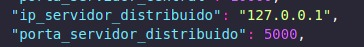

# Trabalho 1 - Fundamentos de Sistemas Embarcados

O presente projeto possui como finalidade a criação de um sistema distribuido de automatização predial para monitoramento e acionamento de dispositivos de um prédio com diversas salas. Segue o link para acesso ao enunciado completo do projeto da disciplina: [trabalho 1 ](https://gitlab.com/fse_fga/trabalhos-2022_2/trabalho-1-2022-2)  


## Dados do Aluno

| Nome                          | Matrícula  |
| ----------------------------- | ---------- |
| Lorrany Oliveira Souza        | 18/0113992 |

## Dependências

- Python3

## Como Executar

Antes de tudo, realize o clone deste repositório em duas placas Raspberry Pi, a qual uma irá fazer o papel de servidor distribuido e a outra de servidor central. Em seguida, escolha qual você quer que faça o papel de distribuido e digite o comando abaixo:

```bash
$ cd distruido
```
Dentro da pasta distribuido, para rodar o servidor distribuido você precisa enviar dois arquivos de configuração JSON. Por exemplo:

```bash
$ python3 configuracao_sala_01.json configuracao_sala_02.json
```
OBS: Para setar o IP e Porta utilizados para comunicação via socket com o servidor central, é necessário alterar os dados abaixo, do arquivo de configuração que você enviar primeiro, no caso do exemplo, seria o arquivo configuracao_sala_01.json:



Em seguida, rode o comando abaixo na rasp que você escolheu como servidor central:

```bash
$ cd central
```

Dentro da pasta, rode o comando abaixo:
```bash
$ python3 ip_do_servidor_distribuido porta_configurada_no_arquivo_de_configuração
```
## Vídeo da apresentação

https://youtu.be/lqJmrj77R3E